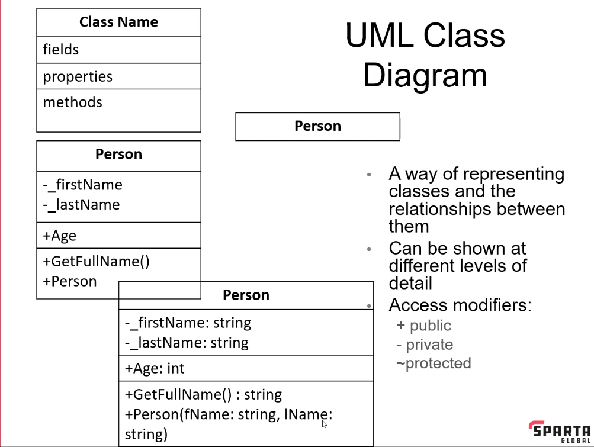
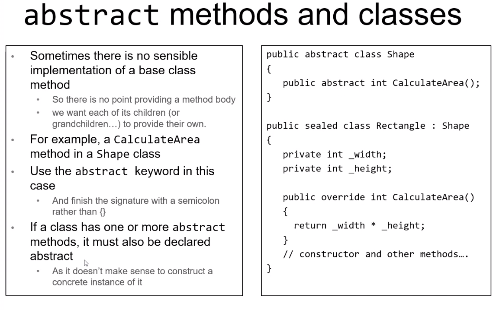
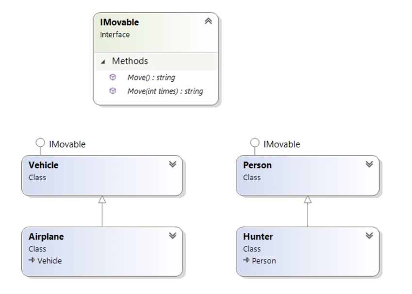
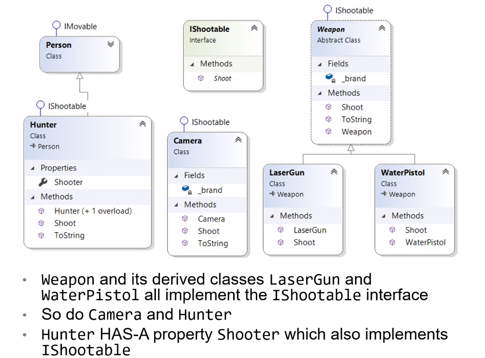
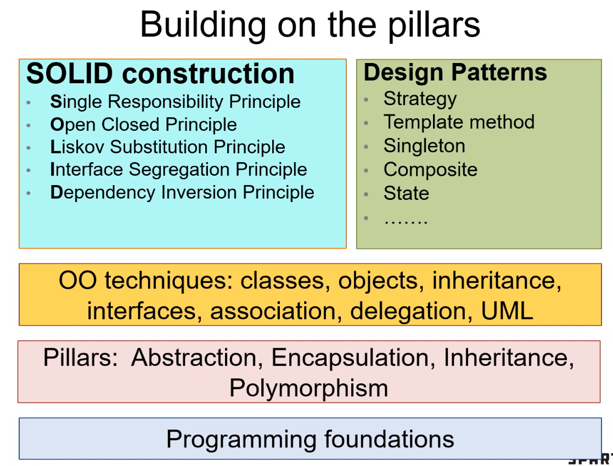

# Four Pillars

**SafariParkApp**

\-     CREATE C# Classes

\-     EXPLAIN the components of a C# class: fields, properties, methods, constructors, object initialisers

\-     RECALL for classes and their components

\-     EXPLAIN the concept of method overloading

\-     CREATE UML class diagrams with the Visual Studio Class Designer

\-     EXPLAIN the relationship between the UML diagrams and C# code

\-     EXPLAIN the similarities and differences between structs and classes

\-     CREATE unit tests for classes and structs

Unified Modelling Language (UML), creating class diagrams

\-     A way of representing classes and the relationships between them

\-     Can be shown at different levels of detail

                                               
 Access modifiers: + public, - private, ~ protected

Classes VS Structs

A struct (short for structure) is similar to a class in that:

\-     They are both data structures that encapsulate data and behaviour

\-     They both can have member fields, constructors, properties and methods

\-     They both can be instantiated with the keyword new

But:

\-     Structs are value types, classes are reference types

\-     Structs cannot inherit from another struct or class, and cannot be inherited from

Property:

A property is a member that provides a flexible mechanism to read, write, or compute the value of a private field. Properties can be used as they are public data members, but they are actually special methods called accessors. This enabled data to be accessed easily and still helps promote the safety and flexibility of methods.

Field:

A field is a variable of any type that is declared directly in a class or struct. Fields are members of their containing type.

 

Virtual methods:

\-     The virtual keyword signifies that method can be overridden in derived classes

\-    Signatures of some methods in 



**Polymorphism**

A way for things to flexibly interact

Same interface, different behaviour

\-     Ibex, Fish, Eagle, Keep all implement moveable interface

\-     Can call same method on all Moveable objects

\-     Different response depending on their class

Many forms of the ToString() method:

\-     All classes derive from the Object class

\-     Defines a virtual ToString() method

​     
 Difference between abstract and interfaces

Abstract allows objects to implement the methods or not, whereas interfaces must implement the methods contained within it.



​          

| S    | SRP  | Single Responsibility Principle |
| ---- | ---- | ------------------------------- |
| O    | OCP  | Open/Closed Principle           |
| L    | LSP  | Liskov Substitution Principle   |
| I    | ISP  | Interface Segregation Principle |
| D    | DIP  | Dependency Inversion Principle  |

Single Responsibility Principle 

\-     A software module (usually class) should represent just one thing

\-     The class members (fields, properties and methods) should be cohesive

o  The fields and properties should hold info about the thing

o  The methods should manipulate or return this information

Open/Closed Principle

\-     Software entities (methods and classes) should be open for extension but closed for modification

\-     The ‘Weapon’ class is abstract and once defined should not be changed

\-     New functionality can be added by creating a derived class

\-     Existing Weapon methods can be modified by overriding them in the derived class

\-     Exception classes and their subclasses in the System namespaces

o  Part of the C# library so can’t change their code

\-     However we can customise an instance of an existing Exception class by providing a meaningful message in its constructor

\-     For more functionality, we can subclass an existing Exception

o  Public class AlienInvasionException : Exception{ };

Liskov Substitution Principle

\-     Subtypes must be substitutable for their base types without breaking the application

\-     Consider the interface

```c#
public interface IMoveable

{

String Move();

String Move(int times);

}
```

\-     We expect any class which implemented this interface to implement these methods

\-     And we can use them anywhere an IMoveable object is expected 

\-     This is the essence of polymorphism

Another LSP violation

\-     Can say not implement a method to fulfil requirement but can’t do that with Interface

\-     Could try throwing an exception

\-     However, still breaks LSP as no other IMoveable objects throw exceptions

\-     Now we need to change all existing to code which calls this method to handle exception

Interface Segregation Principle

\-     Many small, specific interfaces are better than one large, general purpose one

\-     Interface in this context means the public methods and Properties of a code module

\-     Having smaller interfaces that describe only one type of behaviour helps enforce the LSP

\-     Less likelihood that an implementing class will want to implement only part of the interface

\-     We can have it both ways by using interface inheritance

Dependency Inversion Principle

\-     Depend on abstractions rather than concrete instances

\-     High level modules should not depend on low-level modules

o  Both should depend on abstractions

\-     High level

o  Business rules, processes, guts of the app

o  Calculator class, base ratio

\-     By coding Shooter = new Camera(brand)

o  It bounds the Hunter to only using a camera and no other shooters

\-     But by passing in an IShootable instance, provides more flexibility

Another DIP example – GUI calculator

\-     The GUI code behind classes are low level

\-     The calculator class is high level

More OO Principles and Techniques

\-     GRASP: General Responsibility Assignment Software Patterns

\-     Design Patterns

\-     DRY: Don’t Repeat Yourself

\-     YAGNI – You Ain’t Gonna Need it

\-     KISS

PDD – Pain Driven Development

\-     Don’t go wild using all SOLID principles and design patterns

\-     Use simple techniques until they start to cause pain

\-     Then refactor to solve the problem

 

GetHashCode()

When you override Equals(), must override GetHashCode()

Abstract has a signature and no body

Abstract class, any class with an abstract keyword within the methods, can’t instantiate an abstract class, must be inherited from


**C# Collections**

\-     Classes for holding and manipulating groups of primitive types or objects

\-     List, Queue (first in first out), Stack (last in first out), HashSet, Dictionary, and others

\-     System.Collections.Concurrent safe for collections in multithreaded environments

List:

\-     More flexible array

\-     Can be a class, struct or primitive type (numerical, bool, char)

\-     Is a Generic class, can be created to hold any type T, but type must be specified when declared

Queue:

\-     Linear collection of items arranged in order of arrival

\-     New items added to the back

Stack:

\-     Last in , first out

\-     Implemented as array

\-     Push(), Pop(), Peek()

HashSet:

\-     Unordered collection

\-     No duplicate allowed

\-     No index or key to access the elements

\-     UnionWith, IsSubsetOf, Overlaps and SetEquals

\-     Elements ordered by their hashcode, so manipulation and access is very fast